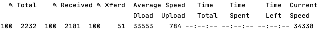

Quarkus using OpenID connect - Keycloak
=======================================

The Quarkus guide you need
--------------------------

Posted by [Marcello Alte](https://github.com/marcello-a) on August 24, 2019

1.  [Abstract](#abstract)
2.  [Part I - Keycloak](#part-i-keycloak)
     * [Download the Keycloak Server](#dl-keykloak)
     *   [Before we run the Server](#before-we-run-the-server)
     *   [Run the Keycloak server](#run-the-keycloak-server)
     *   [First run?](#first-run)
     *   [Add a new realm](#add-a-new-realm)
     *   [Add a client](#add-a-client)
     *   [Add roles](#add-roles)
     *   [Create a user](#create-a-user)
     *   [Client Scopes](#client-scopes)

4.  [Part II - Quarkus](#part-ii-quarkus)
     *   [New project](#new-project)
     *   [Secure a method](#secure-a-method)
     *   [Add the _oidc_ dependency](#add-dependecy)
     *   [Configure the application.properties](#configure-the-properties)

6.  [Part III - Test](#part-iii-test)
     *   [Let\`s test](#test-intro)
     *   [1\. Test - Keycloak build in login](#i-test-keycloak)
     *   [2\. Test - Via console](#ii-test-console)
     *   [3\. Test - Postman](#iii-test-postman)

8.  [Part IV - Trouble Shooting](#part-iv-trouble-shooting)
     *   [Invalid redirect\_uri](#invalid-redirect_uri)
     *   [CORS - Errors](#cors-errors)
10.  [References](#references)

Abstract
--------

In this tutorial you will learn how to configure a Keycloak server to protect a quarkus resource. We will create an example user who is given a role that authorizes him to access a secured resource. We then test the whole thing with the help of Postman and Keycloak.

* * *

Part I - Keycloak
=================

Download the Keycloak Server
----------------------------

First we have to download the Keycloak Server. I used Version 11.0.3 for this tutorial.

Download the server here: [https://www.keycloak.org/downloads](https://www.keycloak.org/downloads)

* * *

Before we run the Server
------------------------

Quarkus is running on port 8080 so do keycloak. Change the HTTP port for the keycloak server to avoid same port binding.  
Go to _.../standalone/configuration/standalone.xml._ and search for _socket-binding-group_

`<socket-binding name="http" port="${jboss.http.port:**8080**}"/>` to

`<socket-binding name="http" port="${jboss.http.port:**8180**}"/>`

* * *

Run the Keycloak server
-----------------------

Run the docker container or use the console.

**Console:**  
Go to the keycloak-11.0.3 directory, then type in the following command:

On Linux: `bin/standalone.sh`  
On Windows: `bin/standalone.bat`

* * *

First run?
----------

Keycloak does not come with a default admin user, which means before you can start using Keycloak you need to create one.  
To do this navigate to http://localhost:8180/, then fill in the form with your preferred username and password.  
Than open the admin console.

* * *

Add a new realm
---------------

Hover above Master in the top left corner and click on **Add realm**  
Choose a name and add the realm.


* * *

Add a client
------------

**What is a client?** The client is any app you whant to secure. It could be a frontend or backend app.

1.  Click on the right menu on **Clients**
2.  Click on **Create** it's in the top right corner of the table
3.  Choose a **ClientID** like _quarkus.backend.YOUR\_NAME_
4.  **Client protocol** is: _openid-connect_
5.  Choose your **Root URL** (where quarkus is running) like _http://localhost:8080_
6.  **Save**


So now we have a client. But what about roles?

* * *

Add roles
---------

**What is a role?** Roles identify a type or category of user. Admin, user, manager, and employee are all typical roles that may exist in an organization. \[@KEYC21a\]

1.  Click on the right menu on **Roles**
2.  Click on **Add Role** it's in the top right corner of the table
3.  Choose a **Role Name** like _user_
4.  (optional) Write a **Description**
5.  **Save**


Now we have roles, but we need users as well. Let's create some.

* * *

Create a user
-------------

1.  Click on the right menu on **Users**
2.  Click on **Add User** it's in the top right corner of the table
3.  Choose a **Userneame** like _testUser_
4.  (optional) Fill other fields
5.  **Save**


The user needs credentials, so let's add some:

1.  Click on thetop navbar on **Credentials**
2.  Choose a **Password** like _user_
3.  Set **Temporary** to off. Otherwise, the user will be forced to change the password on first login.
4.  **Save**


Now assign a role to the user.

1.  Click on thetop navbar on **Role Mapping**
2.  Choose **Available Roles** like _user_
3.  Click on **Add selected**


Now we are done with the user. Let's confiure our realm!

* * *

Client Scopes
-------------

**What is a client scope?** When a client is registered, you must define protocol mappers and role scope mappings for that client. It is often useful to store a client scope, to make creating new clients easier by sharing some common settings. This is also useful for requesting some claims or roles to be conditionally based on the value of scope parameter. Keycloak provides the concept of a client scope for this. \[@KEYC21a\]

Quarkus is using microprofile, so it expects the roles will be stored in groups (in the header). OpenId is placing roles in a field called roles. So we need to change that.

1.  Click on the right menu on **Clients**
2.  Click on your client _(quarkus.backend.YOUR\_NAME)_
3.  Select the **microprofile-jwt** _(Optional Client Scopes)_
4.  Click on **Remove selected**
5.  Select the **microprofile-jwt** _(Default Client Scopes)_
6.  Click on **Add selected**


**Now we are done on Keycloak!**

* * *

Part II - Quarkus
=================

New project
-----------

Get started with a fresh project or include it in yours.

```bash
mvn io.quarkus:quarkus-maven-plugin:1.10.5.Final:create \   
    -DprojectGroupId=eu.ma \ 
    -DprojectArtifactId=keycloak-getting-started \ 
    -DclassName="eu.ma.keycloak.getting.started.SecuredResource" \ 
    -Dpath="/secured"      

cd keycloak-getting-started
```

* * *

Secure a method
---------------

Go to the ressource file you would like to protect and add the annotation _@RolesAllowed("user")_ to a method. You can use this annotation for methods or classes. \[@ODoc21a\]

```java
import javax.annotation.security.RolesAllowed;      
import javax.ws.rs.GET;   
import javax.ws.rs.Path;   
import javax.ws.rs.Produces;   
import javax.ws.rs.core.MediaType;      

@Path("/secured")   
public class SecuredResource {      

    @GET
    @RolesAllowed("user")
    @Produces(MediaType.TEXT_PLAIN)
    public String hello() {   
        return "Hello secured RESTEasy";
    }
```

* * *

Add the _oidc_ dependency
-------------------------

Add the oidc dependency to your pom.xml.

```
<dependency>
    <groupId>io.quarkus</groupId>
    <artifactId>quarkus-oidc</artifactId>   
</dependency>
```

If you run quarkus now _(mvn clean compile quarkus:dev)_, you will get the following error:

```
'auth-server-url' is not present. Both 'auth-server-url' and 'client-id' or alternatively 'public-key' must be configured when the quarkus-oidc extension is enabled   Quarkus application exited with code 1
```

So let's fix that!

* * *

Configure the application.properties
------------------------------------

We have to tell quarkus where the auth-server is running. So we go to the application.properties file and add a few lines.

```
# Auth server URL   
quarkus.oidc.auth-server-url=http://localhost:8180/auth/realms/YOUR_NAME      
# Client id (name you defined on the auth server)   
quarkus.oidc.client-id=quarkus.backend.YOUR_NAME      
# Choose Application type (service = REST service || web-app = server side client application)   
quarkus.oidc.application-type=service      
# Enable CORS to avoid cors errors   q
uarkus.http.cors=true
```

**NOTE:** Auth server URL can be checked by clicking on **Realm Settings** on **General** you will find **Endpoints**. Click than on **OpenId Endpoint Configuration**. Then you will see an JSON String `({"issuer":"http://localhost:8180/auth/realms/YOUR_NAME", ...)`


Now run the quarkus server _(mvn clean compile quarkus:dev)_. If you try to reach the secured ressource _[http://localhost:8080/secured](http://localhost:8080/secured)_, you will get an 401 Unauthorized. Yey we secured our ressource! But how can we test if we have access with the correct credentials?


* * *

Part III - Test
===============

**If you run into problems, check out the trouble section section below!**

Let's test
----------

I will show you three different possibilities to test if the keycloak server is working properly. The first one will be a build in login from keycloak, because some prefer a GUI. Then I will show how we can get an Bearer Token via console. Finally we connect via Postman.

* * *

1\. Test - Keycloak build in login
----------------------------------

If you use this test method, you have to change the **Root URL** and the **Valid Redirect URL** to _https://www.keycloak.org/app/_. Don't forget to undo this step, if you want to access by quarkus later!


Keycloak has a nice build in possibility to check that a user can log in. For this you have to open the following URL in your browser: [https://www.keycloak.org/app/](https://www.keycloak.org/app/). Than fill out the form.

Keycloak URL _(URL to the keycloak server)_

Realm _(Your realm name)_

Client _(Your client name)_

**NOTE:** The Keycloak URL is default Port 8080! So double check if you have choosen the correct port.


Click on **Save** and than on **Sign in**. Type in the credentials _(testUser | user)_ an voilà, your are logged in.

* * *

2\. Test - Via console
----------------------

Open a console and type in the following.  
**Explanation:** In the first line we tell, that we want to save the Bearer token in a variable called _$access\_token_.  
In the secound line we send a POST request to the Keycloak server URL wich gives us access to a token.  
In the third line we set the header for the request.  
In the last line we define the body with user credentials and the grant\_type. Finally we tell how we want to get the token, as raw output.

`export access_token=$(\      curl -X POST http://localhost:8180/auth/realms/YOUR_NAME/protocol/openid-connect/token \      --user quarkus.backend.YOUR_NAME:secret \      -H 'content-type: application/x-www-form-urlencoded' \      -d 'username=testUser&password=user&grant_type=password' | jq --raw-output '.access_token' \   );`

The output should be as showen below:



Now we got a Bearer token, let's use it with the following command:  
**Explanation:** We going to make a GET request on the in line two defined URL. In the header we write our Bearer token, wich we saved earlier.

```
curl -v -X GET \   
    http://localhost:8080/secured \
    -H "Authorization: Bearer "$access_token
```

The output should be as showen below:


* * *

3\. Test - Postman
------------------

I will guide you now trough a postman request on a secured ressource.

1.  Make a new request
2.  Do a **GET** on _http://localhost:8080/secured_
3.  Go to the **Authorization** tab
4.  Select the **Type** _OAuth 2.0_
5.  Now fill out the form like my example below:
   - Access Token _(Will be generated later!)_
   - Header Prefix _(Bearer)_
   - Token Name _(A name you like! (quarkus.backend.YOUR\_NAME Token))_
   - Grant Type _(Password Credentials)_
   - Access Token URL _(http://localhost:8180/auth/realms/YOUR\_NAME/protocol/openid-connect/token)_
   - Client ID _(quarkus.backend.YOUR\_NAME)_
   - Client Secret _(none - we didn't setup that!)_
   - Username _((testUser))_
   - Password _((user))_
   - Scope _(microprofile-jwt)_
   - Client Authentication _(Send as Basic Auth header)_
6.  Click on **Get new Access Token**
7. If successful you will see _Authentication complete_. Click on **Proceed**
8. Now use the token by clicking on **Use Token**
9. **Send** your Request!
10. Done!


* * *

Part IV - Trouble Shooting
==========================

Invalid redirect\_uri
---------------------


This error will show up, if the **Valid Redirect URIs** is not set correctly.

The quickest way to eliminate the error is to add a **\*** at the **Valid Redirect URIs**. You can find this at _**Clients** > **quarkus.backend.YOUR\_NAME** > **Settings**_  
With the **\*** you say that any URI can be redirected. **You should never do this in production!**


* * *

CORS - Errors
-------------

If you have CORS problems, make sure you have added the following line to your _application.properties_:  
`# Enable CORS to avoid cors errors   quarkus.http.cors=true`

If you still have problems, go to the Keycloak admin console.  
**Client** -> _Client\_name_ -> **Settings** -> **Web Origins**  
Then add the origin or as quick help **\***.  
**Don't use \* in production!**

* * *

Thanks for reading! I hope it helps in some way!

* * *

##### References

\[@KEYC21a\]
[https://www.keycloak.org/docs/11.0/server\_admin/](https://www.keycloak.org/docs/11.0/server_admin/)

\[@ODoc21a\]
[https://docs.oracle.com/javaee/6/api/javax/annotation/security/RolesAllowed.html](https://docs.oracle.com/javaee/6/api/javax/annotation/security/RolesAllowed.html)
